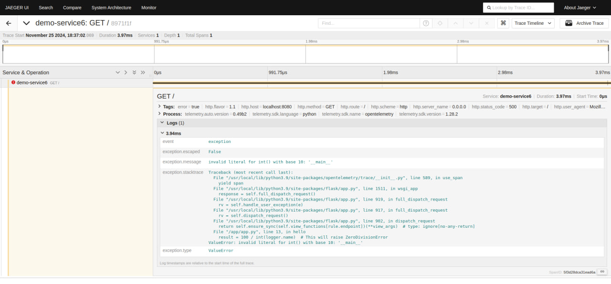

# Running Collector

```shell
docker compose up -d
```

The demo exposes the following backends:
- Jaeger at http://0.0.0.0:16686  Distributed tracing visualization - shows request flows across services
- Zipkin at http://0.0.0.0:9411  Alternative trace viewer with different UI/features
- Prometheus at http://0.0.0.0:9090 Time-series metrics visualization and querying
  - in proemeteus search for "operation_counter"

Run to feed with dummy data
```bash
TRACE_ID=$(openssl rand -hex 16) && \
TIME_NOW=$(date +%s%N) && \
SPAN_ID=$(openssl rand -hex 8) && \
curl -X POST http://localhost:4318/v1/traces -H "Content-Type: application/json" -d '{"resourceSpans":[{"resource":{"attributes":[{"key":"service.name","value":{"stringValue":"test-service"}}]},"scopeSpans":[{"spans":[{"traceId":"'$TRACE_ID'","spanId":"'$SPAN_ID'","name":"test-operation","startTimeUnixNano":"'$TIME_NOW'","endTimeUnixNano":"'$TIME_NOW'","attributes":[{"key":"custom.attr","value":{"stringValue":"test-value"}}]}]}]}]}' && \
curl -X POST http://localhost:4318/v1/logs -H "Content-Type: application/json" -d '{"resourceLogs":[{"resource":{"attributes":[{"key":"service.name","value":{"stringValue":"test-service"}}]},"scopeLogs":[{"logRecords":[{"traceId":"'$TRACE_ID'","spanId":"'$SPAN_ID'","timeUnixNano":"'$TIME_NOW'","severityText":"INFO","body":{"stringValue":"Operation completed"}}]}]}]}' && \
curl -X POST http://localhost:4318/v1/metrics -H "Content-Type: application/json" -d '{"resourceMetrics":[{"resource":{"attributes":[{"key":"service.name","value":{"stringValue":"test-service"}}]},"scopeMetrics":[{"metrics":[{"name":"operation_counter","gauge":{"dataPoints":[{"asDouble":1.0,"timeUnixNano":"'$TIME_NOW'","attributes":[{"key":"trace_id","value":{"stringValue":"'$TRACE_ID'"}}]}]}}]}]}]}'
```

# Instrumented demo app
```bash
cd instrumented_docker_app
docker compose up -d
```
- then go to localhost:8080 (there should be error)
- then go to http://0.0.0.0:16686 and find your trace/logs
